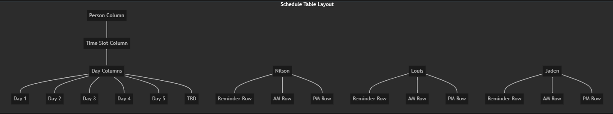

# Weekly Schedule Manager

A Next.js application for managing and visualizing schedule entries in a table format, using Supabase for database management. The application allows users to add and delete schedule entries through a form and displays them in a table grouped by person, time slot, and day.



## Features

- 📝 Add new schedule entries with person, context, day, type, and time slot
- 🗑️ Delete existing entries with a click
- 📊 Visualize entries in a weekly schedule format
- 🔄 Real-time updates using Supabase realtime subscriptions
- 🎨 Color-coded entries by type (Meeting, Task, Reminder, etc.)
- 📱 Responsive design for mobile and desktop

## Tech Stack

- **Frontend/Backend Framework**: Next.js 14+ with App Router
- **Database**: Supabase (PostgreSQL)
- **Styling**: Tailwind CSS
- **Deployment**: Vercel via GitHub

## Getting Started

### Prerequisites

- Node.js 18.x or later
- npm or yarn
- Supabase account (free tier)

### Installation

1. Clone the repository:
   ```bash
   git clone https://github.com/leisureSG99/weeklyScheduler.git
   cd weeklyScheduler
   ```

2. Install dependencies:
   ```bash
   npm install
   ```

3. Set up Supabase:
   - Create a new project at [Supabase](https://supabase.com)
   - After creating your project, go to the SQL editor
   - Copy the contents of the `SUPABASE_SCHEMA.sql` file
   - Paste and run the SQL in the Supabase SQL editor
   - Go to Project Settings > API to get your project URL and anon key

4. Create a `.env.local` file in the project root with the following content:
   ```
   NEXT_PUBLIC_SUPABASE_URL=your_supabase_project_url
   NEXT_PUBLIC_SUPABASE_ANON_KEY=your_supabase_anon_key
   ```

5. Start the development server:
   ```bash
   npm run dev
   ```

6. Open [http://localhost:3000](http://localhost:3000) to see the application running.

## Project Structure

The project follows a standard Next.js structure with the App Router:

```
weeklyScheduler/
├── src/
│   ├── app/
│   │   ├── api/
│   │   │   └── schedule/
│   │   │       ├── route.ts      # GET (all entries), POST (new entry)
│   │   │       └── [id]/
│   │   │           └── route.ts  # GET, PUT, DELETE specific entry
│   │   ├── globals.css           # Global styles
│   │   ├── layout.tsx            # Root layout
│   │   └── page.tsx              # Main application page
│   ├── components/
│   │   ├── EntryForm.tsx         # Form for adding new entries
│   │   ├── ScheduleTable.tsx     # Table to display schedule entries
│   │   └── TableCell.tsx         # Individual table cell component
│   └── lib/
│       ├── supabase.ts           # Supabase client configuration
│       ├── types.ts              # TypeScript type definitions
│       └── utils.ts              # Utility functions
```

## Database Schema

### Table: schedule_entries
- `id` (UUID, Primary Key)
- `title` (Text, Not Null)
- `person` (Text, Not Null) - e.g., "Nilson", "Louis", "Jaden"
- `context` (Text, Not Null) - e.g., "SSCPMR testing", "EMS Migration"
- `day` (Text, Not Null) - e.g., "1", "2", "3", "4", "5", "TBD"
- `type` (Text, Not Null) - e.g., "Meeting", "Task", "Reminder"
- `time_slot` (Text, Not Null) - e.g., "Reminder", "AM", "PM"
- `created_at` (Timestamp with Time Zone, Default: now())
- `updated_at` (Timestamp with Time Zone, Default: now())

## Deployment

### Deploying to Vercel

1. Push your code to GitHub:
   ```bash
   git add .
   git commit -m "Initial implementation of Schedule Table Manager"
   git push origin main
   ```

2. Connect your GitHub repository to Vercel:
   - Sign up or log in to [Vercel](https://vercel.com)
   - Click "Add New" > "Project"
   - Import your GitHub repository
   - Configure the project:
     - Framework Preset: Next.js
     - Root Directory: `./` (if you're deploying from the repository root)
     - Environment Variables: Add the same variables from your `.env.local` file
   - Click "Deploy"

## Future Enhancements

- User authentication and authorization
- Entry editing functionality
- Advanced filtering options
- Data export functionality
- Drag-and-drop interface for moving entries between cells
- Mobile optimization
- Dark mode toggle
- Custom categories and color schemes

## License

This project is licensed under the MIT License - see the LICENSE file for details.

## Acknowledgments

- Built with [Next.js](https://nextjs.org/)
- Powered by [Supabase](https://supabase.com/)
- Styled with [Tailwind CSS](https://tailwindcss.com/) 